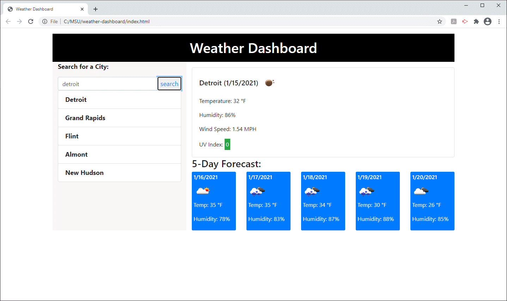

# weather-dashboard
Using OpenWeather API to display the forecast for the cities you search for

# Link to live site
[Weather Dashboard](https://jodybrzo.github.io/weather-dashboard/index.html)

# Technologies Used
JavaScript 71.8%   HTML 23.7%   CSS 4.5%

# Mock-up

## Why I made this project
I made this project because I wanted to integrate a third party API into my code.  I call the OpenWeather API and get the current weather as well as a 5 day forecast.  I used 2 of their API's, 5 Day Weather and one call.  I used 5 day weather so that I can pass in a zip code or city name and get back latitude and longitude.  I take those coordinated and call the One Call API so that I can retrieve the UV Index and a cleaner version if the 5 day forecast.  This project also stores the city search history to local storage and renders it upon page load.

## What I learned
Taking the time to write this project really taught me a lot.  I enjoyed doing the API calls to broaden the scope if data in this and future apps.  I really love working with arrays and objects.

## Challenges 
I had a hard time thinking about how to start this project.  I decided to start with some basic HTML and the API calls and the rest started to fall into place as I got the data back.  I really had a lot of fun learning on this project!